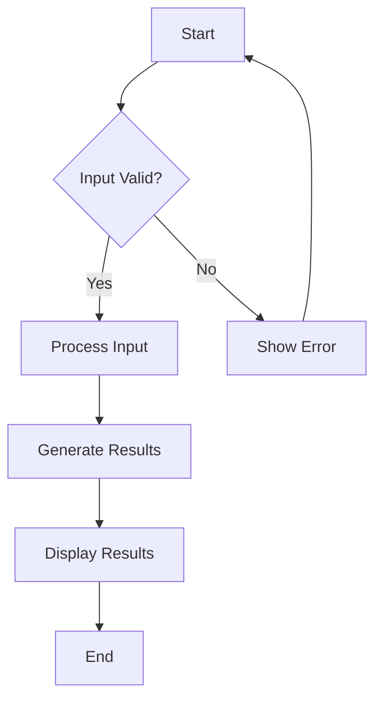
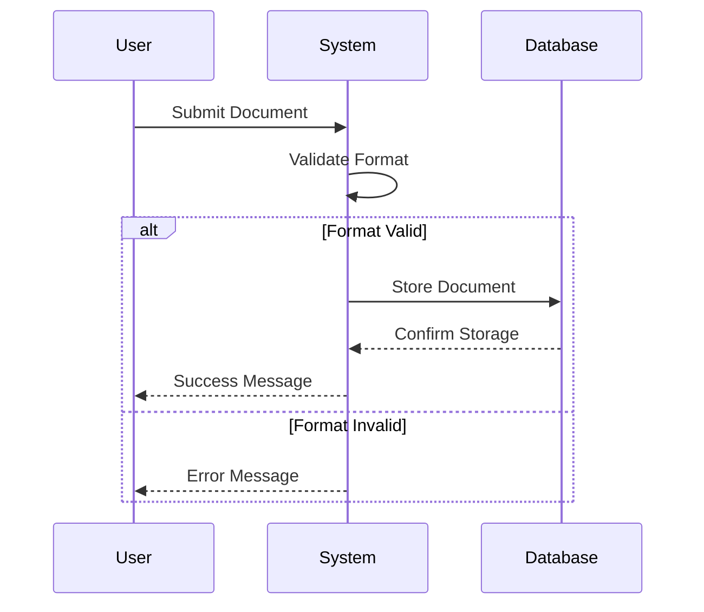
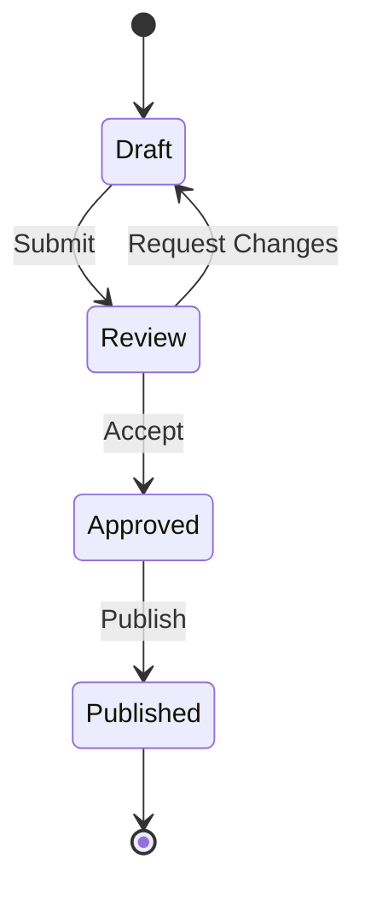

---
author:
  - John Smith
  - Jane Doe
email: contact@example.com
secnum: true
title: "Comprehensive Guide to Markdown-to-PDF Conversion"
toc: true
logo: true
rev: 1.2
bib: true
abstract: This document demonstrates the various features supported by the Markdown-to-PDF conversion system, including syntax highlighting, LaTeX equations, diagrams, and proper document structure.
date: 2025-03-16
---

# Introduction

This document showcases the different features available when converting Markdown to PDF using our system. It serves as a reference example for users who want to create complex documents with rich formatting.

## Purpose

The purpose of this document is to:

1. Demonstrate frontmatter usage
2. Show code syntax highlighting
3. Illustrate LaTeX equation support
4. Present diagrams with mermaid
5. Showcase document structure elements

# Code Examples with Syntax Highlighting

The system supports syntax highlighting for various programming languages using the Pygments library through the minted LaTeX package.

## Python Example

```python
def fibonacci(n):
    """Return the nth Fibonacci number."""
    if n <= 0:
        return 0
    elif n == 1:
        return 1
    else:
        return fibonacci(n-1) + fibonacci(n-2)

# Calculate the first 10 Fibonacci numbers
fib_sequence = [fibonacci(i) for i in range(10)]
print(f"First 10 Fibonacci numbers: {fib_sequence}")
```

## Bash Script Example

```bash
#!/bin/bash

# Check if dependencies are installed
check_dependencies() {
    echo "Checking dependencies..."
    command -v pandoc >/dev/null 2>&1 || { echo "pandoc is required but not installed. Aborting."; exit 1; }
    command -v pygmentize >/dev/null 2>&1 || { echo "pygmentize is required but not installed. Aborting."; exit 1; }
    command -v latexmk >/dev/null 2>&1 || { echo "latexmk is required but not installed. Aborting."; exit 1; }
    echo "All dependencies are installed."
}

# Run the checks
check_dependencies
```

## LaTeX Example

```latex
\documentclass{article}
\usepackage{graphicx}
\usepackage{hyperref}
\usepackage{minted}

\title{Example Document}
\author{John Smith}
\date{\today}

\begin{document}
\maketitle

\section{Introduction}
This is an example LaTeX document.

\begin{minted}{python}
def hello_world():
    print("Hello, world!")
\end{minted}

\end{document}
```

# Mathematical Equations with LaTeX Support

The system supports LaTeX equations, both inline and as standalone blocks.

## Inline Equations

The quadratic formula is given by $x = \frac{-b \pm \sqrt{b^2 - 4ac}}{2a}$ where $a$, $b$, and $c$ are coefficients of the quadratic equation $ax^2 + bx + c = 0$.

The Pythagorean theorem states that $a^2 + b^2 = c^2$ for a right triangle with sides $a$, $b$, and hypotenuse $c$.

## Block Equations

The Taylor series expansion of $e^x$ around $x = 0$ is:

$$e^x = \sum_{n=0}^{\infty} \frac{x^n}{n!} = 1 + x + \frac{x^2}{2!} + \frac{x^3}{3!} + \ldots$$

Maxwell's equations in differential form:

$$
\begin{aligned}
\nabla \cdot \vec{E} &= \frac{\rho}{\varepsilon_0} \\
\nabla \cdot \vec{B} &= 0 \\
\nabla \times \vec{E} &= -\frac{\partial \vec{B}}{\partial t} \\
\nabla \times \vec{B} &= \mu_0 \vec{J} + \mu_0 \varepsilon_0 \frac{\partial \vec{E}}{\partial t}
\end{aligned}
$$

# Diagrams with Mermaid Support

The system supports diagrams created with Mermaid. Below are some examples.

## Flowchart



## Sequence Diagram



## State Diagram



# Tables and Lists

## Tables

| Feature             | Supported | Notes                           |
| ------------------- | --------- | ------------------------------- |
| Syntax Highlighting | Yes       | Using Pygments via minted       |
| LaTeX Equations     | Yes       | Both inline and block equations |
| Mermaid Diagrams    | Yes       | Requires mermaid-filter         |
| Table of Contents   | Yes       | Set `toc: true` in frontmatter  |
| Bibliography        | Yes       | Set `bib: true` in frontmatter  |
| Custom Styling      | Yes       | Through LaTeX templates         |

## Ordered Lists

1. Check system requirements
2. Install dependencies:
   1. Node.js and npm
   2. Puppeteer
   3. TeX Live
   4. Pygments
3. Configure frontmatter
4. Run the conversion script

## Unordered Lists

- Document features:
  - Frontmatter metadata
  - Code blocks with syntax highlighting
  - Mathematical equations
  - Diagrams
- Build process options:
  - Manual build with local dependencies
  - Docker-based build for consistent environment
- Output formats:
  - PDF (primary)
  - Other formats through Pandoc

# Images

Images can be included in the document and will be properly rendered in the PDF output.

Images can also have captions and references:


_Figure 1: Overview of the build process_

# Citations and Bibliography

When `bib: true` is set in the frontmatter, you can include citations and a bibliography section will be automatically generated. This requires a separate BibTeX (.bib) file with your references.

For example, if you have a file named `references.bib` with the following content:

```bibtex
@article{smith2023,
  author    = {Smith, John and Johnson, Barbara},
  title     = {Modern Approaches to Document Conversion},
  journal   = {Journal of Documentation},
  volume    = {45},
  number    = {2},
  pages     = {123--145},
  year      = {2023},
  doi       = {10.1000/journal.doc.2023.45.2.123}
}

@techreport{johnson2024,
  author      = {Johnson, Barbara},
  title       = {Docker Containers for Document Processing},
  institution = {Institute of Documentation},
  number      = {TR-2024-01},
  year        = {2024},
  month       = {1},
  address     = {New York, NY}
}
```

You can then cite these references in your markdown file using:

According to Smith et al. [@smith2023], the conversion process has been significantly improved in recent years.

The Docker-based approach provides a more consistent environment for document generation [@johnson2024].

When using Pandoc with the `--bibliography=references.bib` flag (which the conversion script handles automatically when `bib: true` is set), it will generate the bibliography section at the end of the document.
