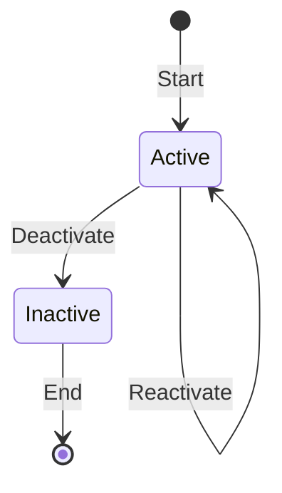

# Section 1: Introduction

Welcome to this document. Here you will find basic information about our project.

## Subsection A: Overview

This subsection provides an overview of the project's purpose and main features.

# Section 2: Installation

Follow these steps to install the software:

```bash
sudo apt update
sudo apt install -y your-software
```

# Section 3: Usage

To use the software, start by entering the following command:

```bash
your-software --help
```

## Subsection B: Advanced Usage

For more advanced features, use the options described below:

```bash
your-software --option1
your-software --option2
```

# Section 4: State Machine Diagram

Below is an example of a Mermaid diagram representing a simple state machine:



# Section 5: Conclusion

Thank you for using our software. For more information, contact support@example.com.
