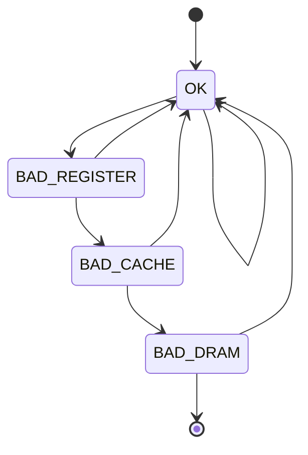
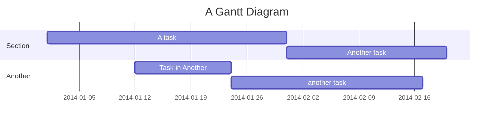

# Example Introduction

Welcome to this document. Here you will find basic information about our project.

## Example Overview

This subsection provides an overview of the project's purpose and main features.

# Example Installation

Follow these steps to install the software:

```bash
sudo apt update
sudo apt install -y your-software
```

# Usage

To use the software, start by entering the following command:

```bash
your-software --help
```

## Subsection B: Advanced Usage

For more advanced features, use the options described below:

```bash
your-software --option1
your-software --option2
```

# Example Diagrams

## State Machine Diagram

Below is an example of a Mermaid diagram representing a simple state machine:



## Gantt Diagram



# Conclusion

DONE
